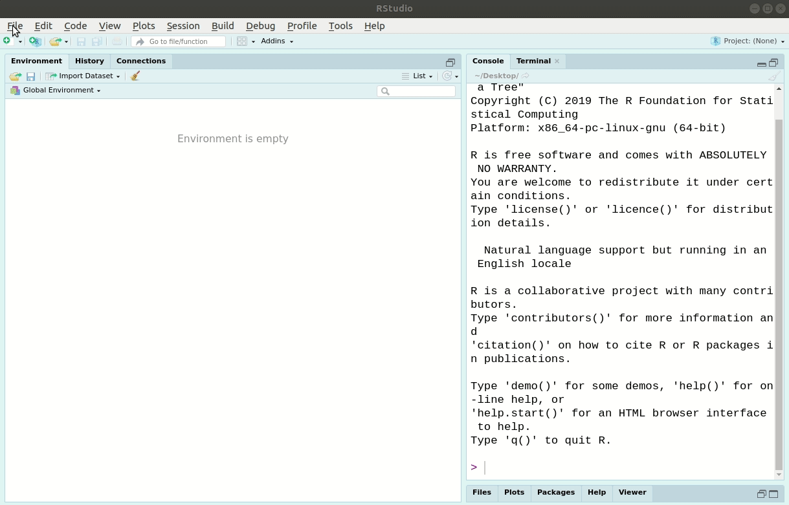

```{r, echo = FALSE}
knitr::opts_chunk$set(
  collapse = TRUE,
  comment = "#>",
  eval = TRUE
)
```

prodigenr, or *pro*ject *di*rectory *gen*erator, was designed to simplify the process of
creating new data analysis projects and to help make your workflow more
reproducible from the beginning.
Standard files and folders are created for specific projects (e.g. abstracts or
manuscripts). While creating individual folders and files manually for new 
projects doesn't take too much time, over time and over many researchers, this
can quickly add up to a lot of time! Plus, when a standard structure is followed
it makes it easier to share code and establish reproducible practices earlier on
in the project.

## Setting up a project with prodigenr

Starting a research project? Create a project directory like so:

```{r manuscript-proj}
library(prodigenr)
# Create a temporary folder using the fs package
new_project_path <- fs::path_temp("HeartDiseaseExercise")
setup_project(new_project_path)
```

Or via RStudio's interface (with RStudio version >1.1):



The resulting file structure should look something like this:

```{r folder-tree, echo=FALSE, comment="", results="markup"}
prodigenr:::viz_project_tree(new_project_path)
```


`README.md` files are contained within each project and in each folder that explains
a bit more about what each folder and file are used for, which is briefly described
here:

- `R/`: Should contain the R scripts and functions used for the analysis.
- `doc/`: Should contain the files related to presenting the project's
scientific output (e.g. manuscript).
- `data/`: If relevant, is where the processed (or simulated) data is kept that
is used for the project as well as the results of the project's analyses.
- `data-raw/`: If relevant, is where the scripts that process the raw data into 
the usable data are kept and, optionally where the raw data is also kept.
- `DESCRIPTION`: Is a standard file that includes metadata about your project, in
a machine readable format, and that also stores a list of the R packages your project
depends on.
- `.Rproj`: Is a standard file used by RStudio to set some R Project specific
settings.

To add a new document (e.g. slides, manuscript), run any of the `create_*()`
commands (e.g. `create_manuscript()`) in the console while in RStudio in the
newly created project (via the `.Rproj` file):

```{r example-create-function, eval=FALSE}
# you need to run these in the project's console
create_manuscript()
create_slides()
```

```{r poster-abstract-hide, echo=FALSE}
# you need to run these in the project's console
withr::with_dir(
    new = new_project_path,
    code = {
        create_manuscript()
        create_slides()
    }
)
```

Now two more files have been added to the `doc/` folder. The resulting file
structure should look something like this:

```{r file-structure-with-doc, echo=FALSE, results="markup", comment=""}
withr::with_dir(fs::path_temp(), {fs::dir_tree(basename(new_project_path))})
```

At present, there are only two template files that you can view:

```{r templates}
template_list
```

These template files are what an academic researcher likely typically encounters.
However, if you have a suggestion or want to add a template, please create a
[Github issue](https://github.com/rostools/prodigenr/issues) or submit a [Pull Request](https://github.com/rostools/prodigenr/pulls)!

The end goal of each project is to be as self contained as possible. So that if
you ever need to go back to the analysis, it is easy to re-run the code and get
the results that you say you got. This is especially useful if others such as
reviewers ask for something or want to confirm your results. 
See the [manifesto](https://rostools.gitlab.io/manifesto) for more details on 
the underlying philosophy behind this package. 

## Related packages or projects

There are several ways of handling a project. There a few packages that have
similar functionality as `prodigenr` package structure:

- [`ProjectTemplate`](http://projecttemplate.net/) is well documented and still
actively developed. Only downside is that it is fairly complicated to use and
complex in the project workflow it creates.
- [`makeProject`](https://cran.r-project.org/package=makeProject)
is very simple and stripped down in what it creates and in it's use. Downside is
that it wasn't updated since 2012.
- Use of the R package structure via
[`devtools`](https://cran.r-project.org/package=devtools) (or
[`usethis`](https://cran.r-project.org/package=usethis)),
which is argued for in this
[blog](https://rmflight.github.io/posts/2014/07/vignetteAnalysis.html) and
compared to `ProjectTemplate` in this
[blog](https://rmflight.github.io/posts/2014/07/zpackages_vs_projectTemplate.html)).
- [`rrtools`](https://github.com/benmarwick/rrtools) is very similar to prodigenr, 
except it focuses only on manuscripts. Is well thought out and the documentation
is well written.
- [`workflowr`](https://github.com/jdblischak/workflowr) is a workflow for creating
online, data science content.

There is also a list of other similar projects 
[on the rOpenSci GitHub repository](https://github.com/ropensci/rrrpkg#useful-tools-and-templates-for-making-research-compendia). 
It's up to you to decide which style to use. 
